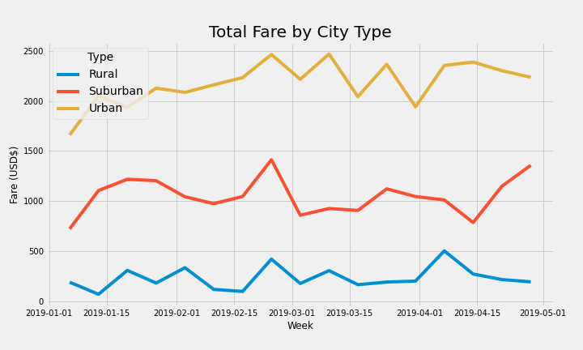

# PyBer_Analysis

## Overview
Here we will be using data from Pyber to create a summary of ride-sharing data by city type.

## Objective
First, Pandas is used to create a ride-sharing DataFrame by city type.  Then, matplotlib will be used to produce a multiple-line chart of total fares for each city type.

## Results

Below are summary statistics of the PyBer data

Total Rides:
-13x urban:rural 
-2.5x urban:suburban

Total Drivers:
-111x urban:rural 
-7x urban:suburban

Total Fares:
-9.5x urban:rural 
-2x urban:suburban
**This trend is visualized in the line plot below**

Average fare per Ride:
1.1x **rural:urban**
1.4x **rural:suburban**

Average fare per driver:
13x **rural:urban**
3.5x **rural:suburban**

##

Below are the Total Fares by City Type by week. A 9 week period is represented from 2019-01-01 to 2019-05-01.

The week to week variation does not significantly effect the trends.

## Summary

####Recomendations to Pyber Leadership:
 - Reduce ride prices in rural communities to increase total rides.
 - Promote Pyber in urban communities to increase total rides to improve average fare per driver
 - Consider limiting total urban drivers at any time to improve average fare per driver

